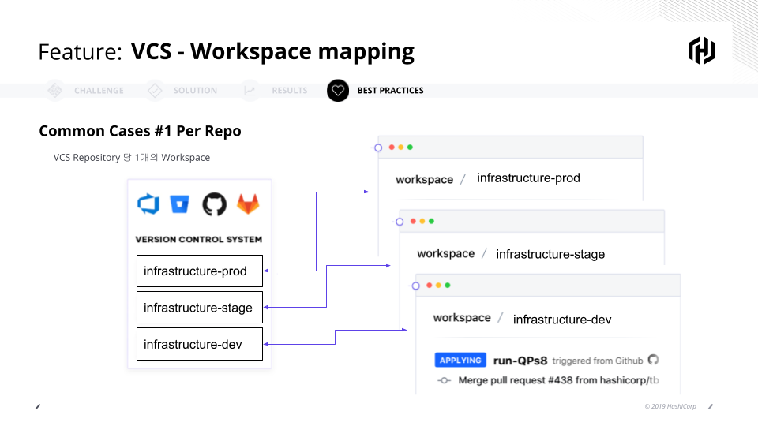
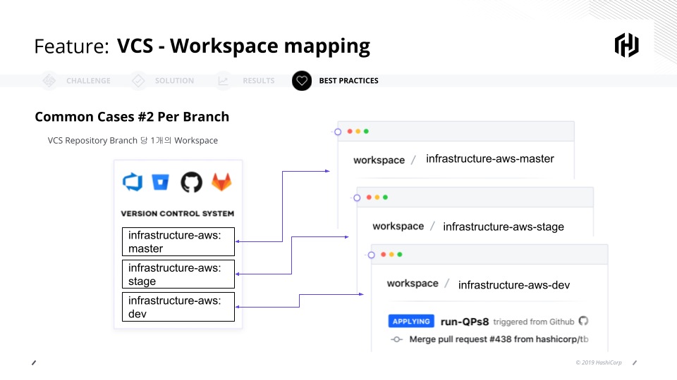
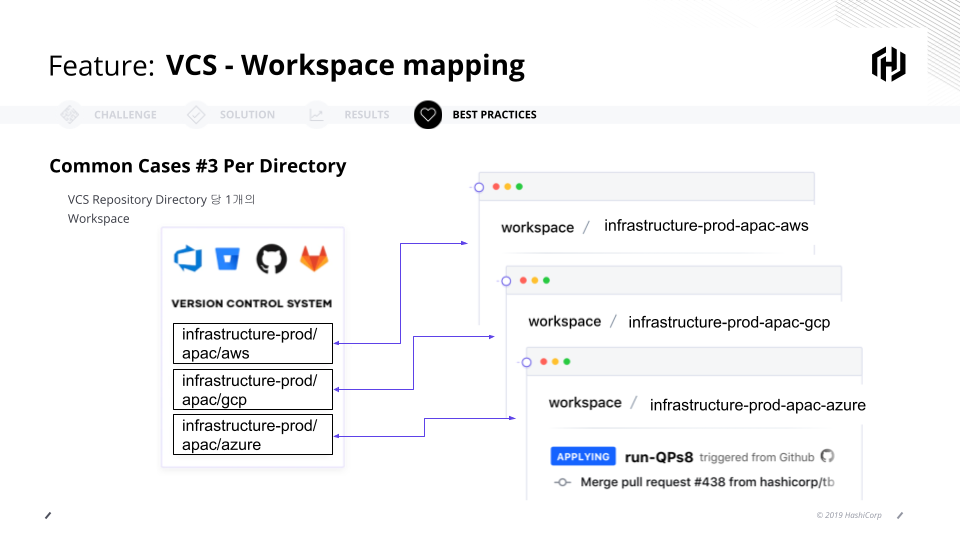
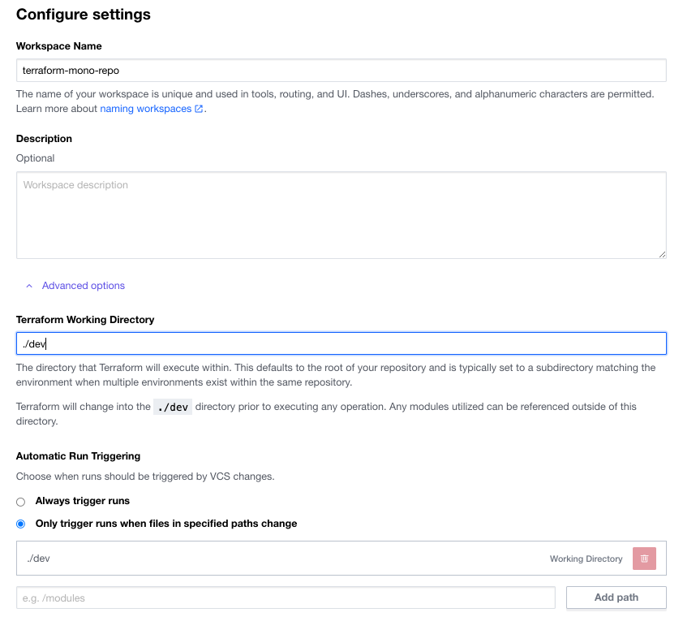
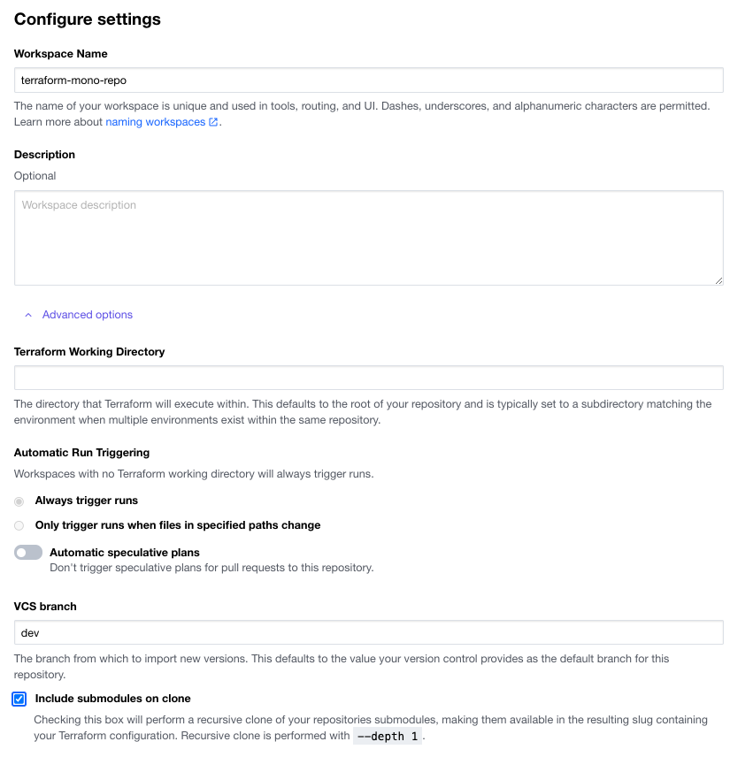

# 단일 저장소(Mono Repository)를 사용한 소스 코드 관리

Terraform 사용 시 단일 저장소를 사용하여 인프라를 관리하는 방안을 소개하고자 합니다.

## 1. Terraform OSS를 사용하는 경우 - local backend
OSS를 사용하여 Terraform Configuration Template을 작성하게 되면 다음과 같이 디렉토리 구조를 가져가게 됩니다.

1. 기본 디렉토리 구조
다음과 같이 인프라 생성을 위한 Terraform Configuration Template 파일을 하나의 디렉토리에 만들게 됩니다.

```bash
❯ tree
.
├── main.tf
├── outputs.tf
└── variables.tf
```
2. 스테이지별 환경 분리
개발계, 스테이지, QA/UAT, Production과 같이 다양한 환경을 위해 다음과 같이 디렉토리를 분리하여 관리하게 됩니다. (동일한 파일은 Soft link를 통해 재 사용 가능)

```bash
❯ tree
.
├── dev
│   ├── main.tf
│   ├── outputs.tf
│   └── variables.tf
├── stage
│   ├── main.tf
│   ├── outputs.tf
│   └── variables.tf
└── prod
    ├── main.tf
    ├── outputs.tf
    └── variables.tf
```
3. 동일 기능을 모듈로 대체.
동일한 기능을 수행하는 모듈화하여, 코드 재 사용성을 높임
```bash
❯ cat main.tf
# Configure the Nomad provider
provider "nomad" {
  address = "http://nomad.service.consul:4646"
}

module "nginx-nomad" {
  source = "./prod"

  http_port = var.http_port
  service_name = var.service_name
  service_tag = var.service_tag
}
```
## 2. Terraform Cloud/Enterprise를 사용하는 경우 - Remote backend 
Terraform Cloud/Enterprise를 사용하는 경우에는 Terraform Configuration Template 작성 후 VCS 상의 저장소와 Workspace를 연동하게 됩니다.
이 때, 다음과 같은 3가지 구성 방안 중 하나를 적용하게 됩니다.

- 1 Repo = 1 Workspace
  

- 1 Directory = 1 Workspace (Repo상 하나의 디렉토리를 하나의 Workspace와 연동)
  

- 1 Branch = 1 Workspace (Repo 상 하나의 Branch와 하나의 Workspace를 연동)
  

실제는 3가지 방식을 혼합하여, 상황에 맞게 사용하는 것이 일반적입니다.

현재 데모 시나리오를 위해 하나의 Repo에 여러 개의 디렉토리가 있고, Branch도 dev/stage/main(prod)로 나눠져 있습니다.

### 1. 하나의 Repo에 여러 개의 디렉토리로 구성된 경우
디렉토리와 Workspace를 1:1로 매핑하여 구성할 수 있습니다.
  

### 2. 하나의 Repo가 여러 Branch로 구성된 경우
개별 Branche를 Workspace와 1:1로 매핑하여 구성할 수 있습니다.
  